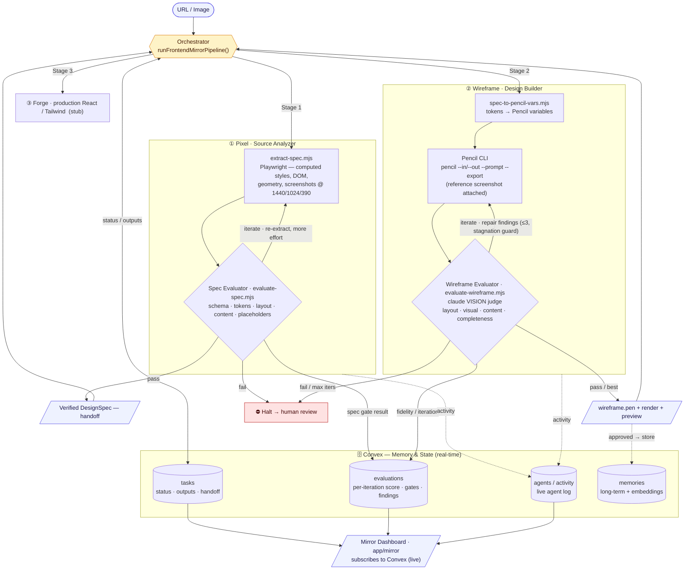

# war_loops — Frontend Mirror Pipeline

Turn a **URL or image** of any web page into a faithful, evaluated **Pencil design** —
autonomously, with quality gates and self-correcting loops at every stage.
*"War loops" = the build → evaluate → repair loops that drive each stage toward a 1:1 mirror.*

```
URL / image ──► Pixel ──► (spec gate) ──► Wireframe ──► (fidelity loop) ──► .pen + render
              extract       pass/iterate     build in        vision judge
              real tokens    /fail            Pencil CLI      → repair → repeat
```

> This repo is a **snapshot** extracted from the `clawd/mission-control` workspace, where the
> pipeline runs integrated with Convex, the agent gateway, and a Next.js dashboard. As a
> standalone repo it documents the architecture and ships the self-contained logic. The
> `scripts/` are fully runnable on their own; `orchestrator.ts` is included as reference
> (it still imports mission-control's Convex/agent layer).

## Architecture



**How to read it**

- **Orchestrator** (`orchestrator.ts`) is the control spine: it sequences the stages, owns every Convex read/write, and decides **pass · iterate · halt** at each gate.
- **Agents** — each paired with an **evaluator**:
  - ① **Pixel** — source analyzer (deterministic extraction)
  - ② **Wireframe** — design builder (drives the Pencil CLI)
  - ③ **Forge** — production code *(stub)*
- **Verification loops — the heart of the system:**
  - **Spec loop** — Pixel extracts → *Spec Evaluator* gates it; `iterate` re-extracts with more effort, `fail` **halts before anything builds on a bad spec**.
  - **Fidelity loop** — Wireframe builds in Pencil → *Wireframe Evaluator* (a `claude` **vision judge**) compares the render against Pixel's reference and returns repair findings → the agent repairs and rebuilds until fidelity clears the bar (≤3 iterations, stagnation guard). **This loop is what drives 1:1.**
- **Memory & state — Convex** (real-time): `tasks` (status, outputs, the verified-spec handoff), `evaluations` (every iteration's score / gates / findings), `agents·activity` (live agent log), `memories` (long-term, embedded). The **dashboard** (`app/mirror`) subscribes to Convex for live spec, iteration scorecards, and the activity feed.

## Stages

| Stage | What it does | Gate / loop |
|-------|--------------|-------------|
| **Pixel** | Headless-Chromium extraction of real computed styles, DOM text, and layout geometry + screenshots at 1440/1024/390 → a `DesignSpec` | **Spec evaluator** (`scripts/evaluate-spec.mjs`): schema / tokens / layout / content / no-placeholders → pass·iterate·fail; retries with more extraction effort |
| **Wireframe** | Translates tokens → Pencil variables, then drives the **Pencil CLI** to build a real `.pen` from the spec (reference screenshot attached to the build) | **Wireframe evaluator** (`scripts/evaluate-wireframe.mjs`): a `claude` vision judge compares the render vs the reference → scored, actionable findings → repair loop toward 1:1 |
| **Forge** | *(stub)* production React/Tailwind from the verified design | — |

## Layout

```
orchestrator.ts                  Pipeline controller (runPixelStage → runWireframeStage)
scripts/
  extract-spec.mjs               Pixel: URL→spec (Playwright) / image→template
  evaluate-spec.mjs              Spec quality gate (deterministic)
  spec.schema.json               Shared DesignSpec contract
  spec-to-pencil-vars.mjs        Deterministic tokens → Pencil variables
  evaluate-wireframe.mjs         Vision-judge fidelity evaluator (drives the 1:1 loop)
squad/                           Agent "souls": pixel, wireframe, forge (+ pipeline contract)
skill/frontend-spec-extractor/   Claude skill wrapping the spec extractor + evaluator
ui/                              Mirror dashboard (Next.js, reference): spec, iteration scorecard, outputs
```

## Standalone usage (the deterministic scripts)

```bash
# Pixel: extract a ground-truth spec from a live page
node scripts/extract-spec.mjs --url https://example.com --out ./out

# Spec gate
node scripts/evaluate-spec.mjs ./out/spec.json

# Tokens → Pencil variables
node scripts/spec-to-pencil-vars.mjs ./out/spec.json

# Wireframe fidelity (after building a render with the Pencil CLI)
node scripts/evaluate-wireframe.mjs --reference ./out/screenshots/desktop.png --render ./out/wireframe.png --spec ./out/spec.json
```

## Requirements

- **Playwright** Chromium (`playwright-core`) for extraction
- **Pencil CLI** authenticated (`pencil login`) for the Wireframe build stage
- **`claude`** CLI authenticated for the vision fidelity judge

## How the loop reaches 1:1

The wireframe agent builds with Pixel's reference screenshot attached, then the vision
judge scores fidelity (layout · visual · content · completeness) and emits concrete repair
instructions. Those feed the next `pencil --in … --out …` pass. Iterates until the score
clears the bar or stops improving — every iteration recorded for benchmarking.
