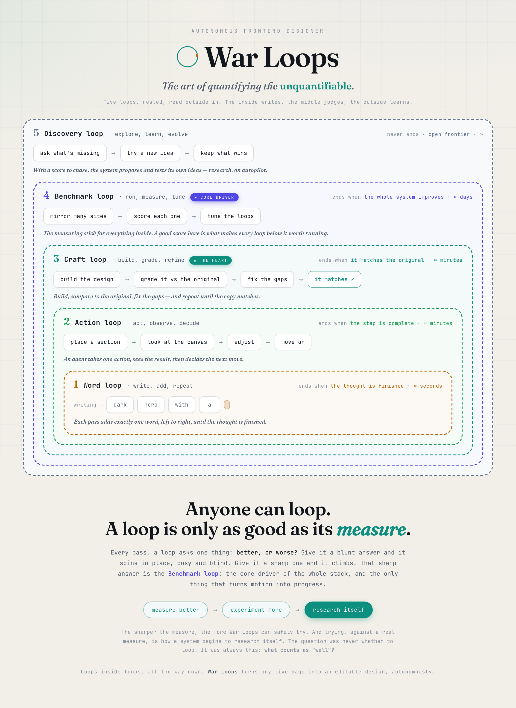
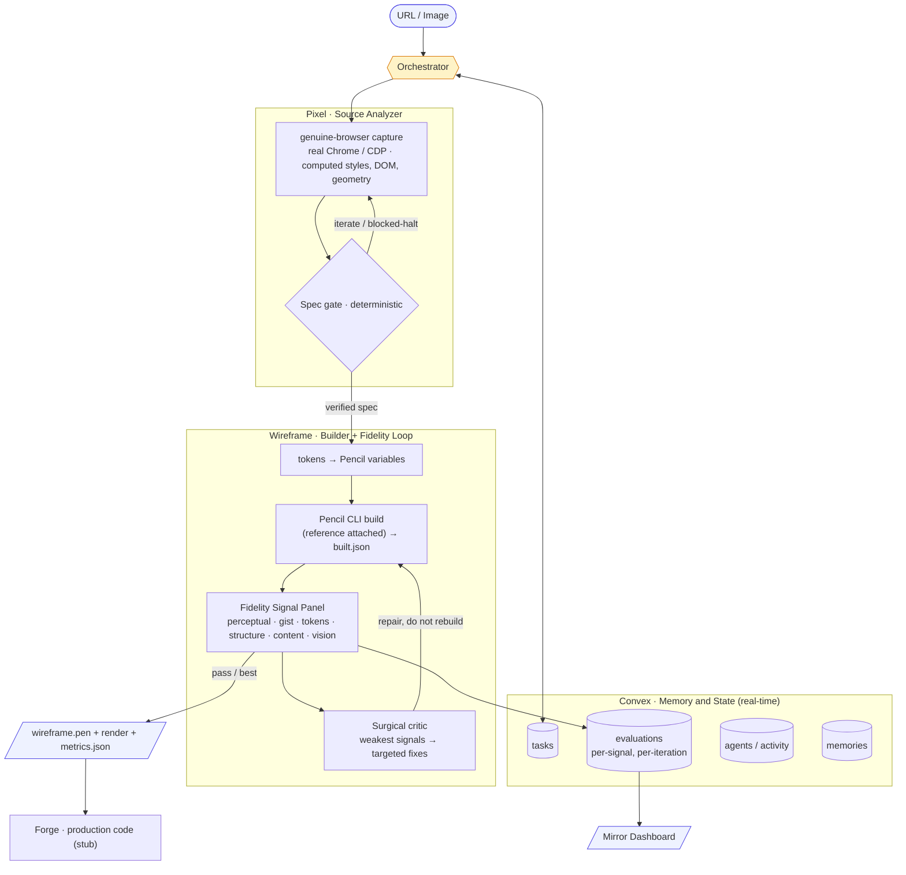

# War Loops: Autonomous Frontend Designer

**The art of quantifying the unquantifiable.**

Point War Loops at a **URL or an image**. It captures the page with a genuine browser, extracts a
ground-truth design spec, rebuilds it in Pencil, and **self-corrects against the original** until a
weighted panel of signals says it matches. The whole thing is a stack of judge-gated loops, and the
judge is the point: design fidelity is something everyone can feel but nobody measures. War Loops
measures it.



## Architecture



The agents (Pixel, Wireframe) are the stable core. The intelligence lives in the **evaluation
spine**: a grounded multi-signal panel, a surgical critic, and a benchmark that tunes the whole
machine over time.

## The loop stack

War Loops is loops nested inside loops, each with its own judge and exit. Read outside-in: outer
loops run slower and rarer (see `docs/loop-hero.html`).

| # | Loop | Each cycle | Exit | Timescale |
|---|------|-----------|------|-----------|
| 1 | Token | sample, append, repeat | stop token | seconds |
| 2 | Agent turn | call tool, feed result | no more tool calls | seconds to min |
| 3 | **Verify** | build, judge, repair | fidelity passes / stagnation | minutes |
| 4 | Benchmark | run corpus, measure, tune | system improves | days |
| 5 | Autoresearch | set goals, allocate, cull | open frontier | continuous |

## Memory

Memory is a first-class part of the design, all backed by Convex plus the model's context window.

| Type | Where | Horizon | Holds |
|------|-------|---------|-------|
| **Short-term** | context window + `tasks` | one turn / run | the verified-spec handoff, previous-stage output, current findings |
| **Episodic** | `evaluations` | the whole run | every iteration's per-signal score, gates, findings |
| **Shared** | `tasks` + `agents/activity` | cross-agent, live | the blackboard agents coordinate through; live activity feed |
| **Long-term** | `memories` | cross-run | approved designs / reusable patterns, retrieved on future tasks |

## How it works

| Stage | What it does | Gate / loop |
|-------|--------------|-------------|
| **Pixel** | Genuine-browser capture of real computed styles, DOM text, and geometry at 1440/1024/390 into a `DesignSpec` | **Spec gate** (deterministic): schema, tokens, layout, content, no-placeholders; hard-halts on a bot-wall capture |
| **Wireframe** | Tokens → Pencil variables, then the Pencil CLI builds a real `.pen` (reference attached) and reports `built.json` | **Signal panel** scores fidelity; the **surgical critic** drives a repair loop toward 1:1 |
| **Forge** | Production React / Tailwind from the verified design | *(stub)* |

## The fidelity signal panel

The heart of the system. Instead of one LLM opinion, fidelity is a **weighted blend of six signals,
five of them non-LLM and deterministic** (so the score does not drift run to run). Pluggable: a new
signal is a file in `signals/` plus a line in `signals.config.json`.

| Signal | Measures | Type |
|--------|----------|------|
| `perceptual` | SSIM, structural similarity to the reference | non-LLM |
| `gist` | overall resemblance (low-res correlation + color histogram) | non-LLM |
| `tokens` | extracted colors/fonts applied in the build | non-LLM |
| `structure` | spec regions present + ordered in the build | non-LLM |
| `content` | required text shipped in the build | non-LLM |
| `vision` | subjective fidelity (layout, color, hierarchy) | `claude` judge, one weighted voice |

Each signal returns a 0..100 score plus findings; the aggregator (`scripts/evaluate.mjs`) blends a
weighted overall, a decision, and merged findings. Signals abstain gracefully if unavailable, so the
panel degrades instead of failing.

## Surgical critic

Repairs are not "dump every finding and rebuild." The critic (`scripts/critic.mjs`) focuses the 1-3
weakest signals and the most impactful findings, and instructs the builder to **fix only those,
touching nothing that already matches**, so each iteration moves forward instead of churning.

## Run metrics: time, tokens, cost

Every run writes `metrics.json` and a dashboard summary like `26m · 4.7M in / 63k out · $6.30`.
Cost is real, not estimated: both token-consuming tools self-report (Pencil builds via `--usage`,
the vision judge via `claude --output-format json`). Everything else (capture, the five
deterministic signals) costs nothing.

## Benchmark and leaderboard

`scripts/benchmark.ts` runs the panel across the `targets.json` corpus and writes a
`leaderboard.md` (per-target fidelity + per-signal breakdown + mean). This is the MetaLoop: it is
how the system answers "are we getting better on average," and the surface where signal **weights get
calibrated** so the overall tracks human judgment.

```bash
npx tsx scripts/benchmark.ts --only=tailwind,vercel,linear
```

### First run (real, measured)

All three captured cleanly (no bot-wall). Cost is self-reported by the tools, not estimated. Full
breakdown in [`docs/benchmark-run.md`](docs/benchmark-run.md).

| target | fidelity | total cost | of which build | wall time |
|--------|----------|------------|----------------|-----------|
| vercel | 72 / 100 | ~$5.2 | $4.34 | ~17 min |
| linear | 72 / 100 | ~$3.0 | $2.10 | ~12 min |
| tailwind | 70 / 100 | ~$6.3 | $5.51 | ~26 min |

Mean fidelity **71 / 100**, in a tight band, and the score held steady when the vision judge drifted
~10 points (the grounding working). **Where the money goes:** the five deterministic signals cost
**$0**, the vision judge is **~$0.27 per eval**, and the **Pencil build agent (opus-4-6) is the whole
bill** at roughly $1.5 to $2 per build. The cost is the build model, and it is a routing dial: send
that one step to a cheaper model and the dominant line item drops, at a quality tradeoff you can
measure on this same benchmark.

## Capture: beating bot walls

Pixel drives a **genuine browser** so protected sites do not flag it as a bot:

- **Default:** real Chrome (`channel:"chrome"`, headed) with a persistent profile; waits for any
  Cloudflare-style JS challenge to auto-clear, and the clearance cookie persists.
- **`--cdp <url>`:** attach to an already-running Chrome (your real, logged-in session).
- **`--headless`:** legacy bundled Chromium (fast, but bot walls block it).

If a capture still lands on a challenge page, the spec is flagged `blocked` and the pipeline halts
instead of building from a wall.

## Repo layout

```
orchestrator.ts                  Pipeline controller (Pixel → Wireframe → Forge)
signals.config.json              Control surface: signal toggles, weights, target
signals/                         Pluggable fidelity signals (perceptual, gist, tokens, structure, content, vision)
scripts/
  extract-spec.mjs               Pixel: genuine-browser capture → spec
  evaluate-spec.mjs              Spec quality gate
  spec.schema.json               The DesignSpec contract
  spec-to-pencil-vars.mjs        Tokens → Pencil variables
  evaluate.mjs                   The weighted signal aggregator
  critic.mjs                     Surgical repair planner
  benchmark.ts                   Run the corpus → leaderboard
targets.json                     Benchmark corpus
squad/                           Agent definitions: pixel, wireframe, forge
skill/frontend-spec-extractor/   Claude skill wrapping the extractor + gate
ui/                              Mirror dashboard: live spec, per-signal scorecard, activity
docs/loop-hero.html              The loop-stack brand explainer
```

## Usage

```bash
# Pixel: extract a ground-truth spec (genuine Chrome by default)
node scripts/extract-spec.mjs --url https://example.com --out ./out
# bot-walled? attach to a running Chrome:  --cdp http://localhost:9222

# Spec gate
node scripts/evaluate-spec.mjs ./out/spec.json

# Multi-signal fidelity of a build vs the original
node scripts/evaluate.mjs --reference ./out/screenshots/desktop.png --render ./out/wireframe.png --spec ./out/spec.json --built ./out/built.json
```

## Requirements

- **Google Chrome** + `playwright-core` (genuine-browser capture)
- **Pencil CLI** authenticated (`pencil login`) for the Wireframe build stage
- **`claude`** CLI authenticated for the vision signal
- `ssim.js`, `jimp` (the non-LLM image signals)

> The `scripts/` and `signals/` run on their own; `orchestrator.ts` and `benchmark.ts` reference
> mission-control's Convex layer and are included as reference.
