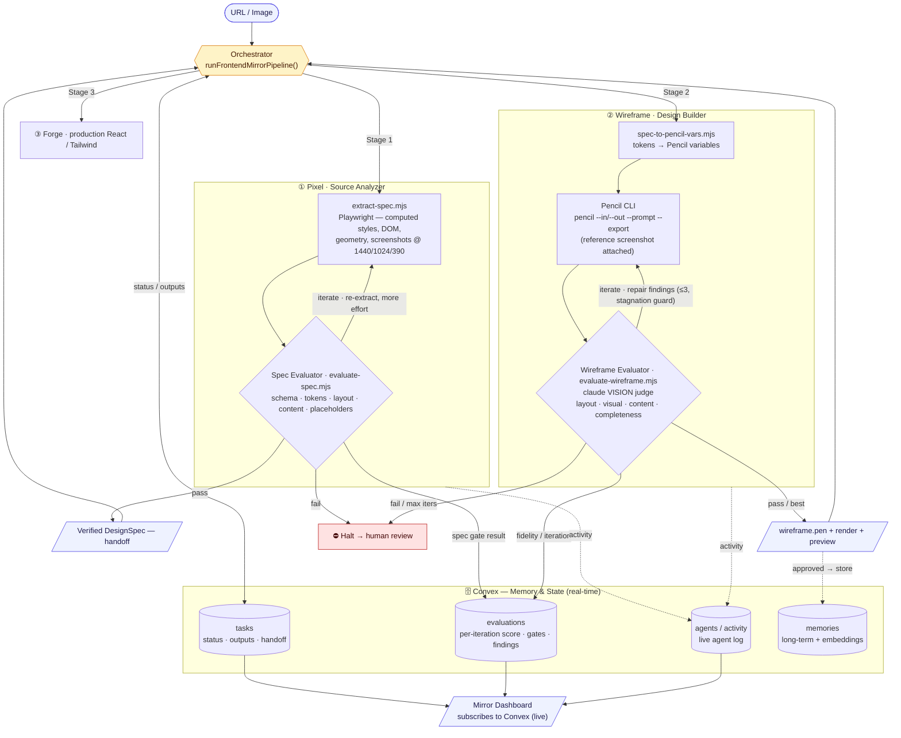

# war_loops

**Mirror any web page into a faithful, editable design — autonomously.**

Point war_loops at a **URL or an image**. It extracts a ground-truth design spec, builds it in
Pencil, and **self-corrects against the original until it's a 1:1 match**. Every stage is guarded
by a verification loop — a deterministic gate on the spec, and a vision-judged fidelity loop on
the build — so it ships *fidelity, not guesses*.

## Architecture



**The pieces**

- **Orchestrator** (`orchestrator.ts`) — the control spine. Sequences the stages, owns every Convex read/write, and makes the **pass · iterate · halt** decision at each gate.
- **Agents**, each paired with an **evaluator**:
  - ① **Pixel** — source analyzer; deterministic extraction of the real page.
  - ② **Wireframe** — design builder; drives the Pencil CLI to build the `.pen`.
  - ③ **Forge** — production React/Tailwind from the verified design.
- **Verification loops — the heart of the system:**
  - **Spec loop** — Pixel extracts → the *Spec Evaluator* gates it; `iterate` re-extracts with more effort, `fail` **halts before anything builds on a bad spec**.
  - **Fidelity loop** — Wireframe builds in Pencil → the *Wireframe Evaluator* (a `claude` **vision judge**) compares the render against the original and returns concrete repair findings → the agent repairs and rebuilds until fidelity clears the bar (≤3 iterations, stagnation guard). **This is what drives 1:1.**
- **Memory & state — Convex** (real-time): `tasks` (status, outputs, the verified-spec handoff), `evaluations` (every iteration's score / gates / findings), `agents·activity` (live agent log), `memories` (long-term, embedded). The **dashboard** subscribes to Convex for live spec, iteration scorecards, and the activity feed.

## How it works

| Stage | What it does | Gate / loop |
|-------|--------------|-------------|
| **① Pixel** | Headless-Chromium extraction of real computed styles, DOM text, and layout geometry + screenshots at 1440/1024/390 → a `DesignSpec` | **Spec evaluator** — schema · tokens · layout · content · no-placeholders → pass·iterate·fail; retries with more extraction effort |
| **② Wireframe** | Translates tokens → Pencil variables, then drives the **Pencil CLI** to build a real `.pen` from the spec (with the reference screenshot attached to the build) | **Wireframe evaluator** — a `claude` vision judge compares the render vs the original → scored, actionable findings → repair loop toward 1:1 |
| **③ Forge** | Production React / Tailwind generated from the verified design | — |

## Repo layout

```
orchestrator.ts                  Pipeline controller (runPixelStage → runWireframeStage → Forge)
scripts/
  extract-spec.mjs               Pixel: URL→spec (Playwright) / image→template
  evaluate-spec.mjs              Spec quality gate (deterministic)
  spec.schema.json               The DesignSpec contract
  spec-to-pencil-vars.mjs        Tokens → Pencil variables
  evaluate-wireframe.mjs         Vision-judge fidelity evaluator (drives the 1:1 loop)
squad/                           Agent definitions: pixel, wireframe, forge (+ pipeline contract)
skill/frontend-spec-extractor/   Claude skill wrapping the spec extractor + evaluator
ui/                              Mirror dashboard: live spec, iteration scorecard, agent activity
```

## Usage

```bash
# ① Pixel — extract a ground-truth spec from a live page
node scripts/extract-spec.mjs --url https://example.com --out ./out

# Spec gate
node scripts/evaluate-spec.mjs ./out/spec.json

# Tokens → Pencil variables
node scripts/spec-to-pencil-vars.mjs ./out/spec.json

# ② Fidelity — score a build against the original
node scripts/evaluate-wireframe.mjs --reference ./out/screenshots/desktop.png --render ./out/wireframe.png --spec ./out/spec.json
```

## Requirements

- **Playwright** Chromium (`playwright-core`) — page extraction
- **Pencil CLI** authenticated (`pencil login`) — the Wireframe build stage
- **`claude`** CLI authenticated — the vision fidelity judge

## How the loop reaches 1:1

The Wireframe agent builds with the original's screenshot attached, then the vision judge scores
fidelity across **layout · visual · content · completeness** and emits concrete repair
instructions. Those feed the next `pencil --in … --out …` pass. It iterates until the score clears
the bar or stops improving — and every iteration is recorded, so fidelity is measurable and
regressions are caught.
