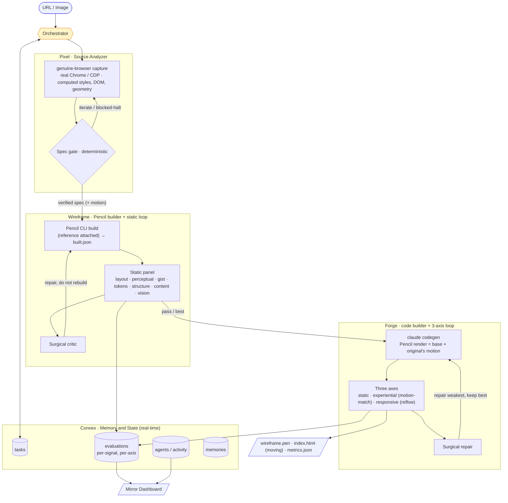

# War Loops: Autonomous Frontend Designer

**The art of quantifying the unquantifiable.**

Point War Loops at a **URL or an image**. It captures the page with a genuine browser, extracts a
ground-truth design spec, and produces **two self-correcting builds**: a polished static mirror in
Pencil, and a **moving code build (Forge)** that reproduces that design and layers on the original's
motion. Every build is judged against the original and repaired until the measures say it matches.
The whole thing is a stack of judge-gated loops, and the judge is the point: fidelity is something
everyone can feel but nobody measures. War Loops measures it on **three axes** - static design,
experiential motion, and responsive reflow.


## Architecture



The agents (Pixel, Wireframe, Forge) are the stable core. The intelligence lives in the **evaluation
spine**: a grounded multi-signal panel, a surgical critic, a benchmark that tunes the machine over
time, and three separately-measured fidelity axes so "static design" and "moves like the original"
never get confused for one another.

## The loop stack

War Loops is loops nested inside loops, each with its own judge and exit. Read outside-in: outer
loops run slower and rarer (see `docs/loop-hero.html`).

| # | Loop | Each cycle | Exit | Timescale |
|---|------|-----------|------|-----------|
| 1 | Token | sample, append, repeat | stop token | seconds |
| 2 | Agent turn | call tool, feed result | no more tool calls | seconds to min |
| 3 | **Verify** | build, judge, repair | fidelity passes / stagnation | minutes |
| 4 | Benchmark | run corpus, measure, tune | system improves | days |
| 5 | Autoresearch | set goals, allocate, cull | open frontier | continuous |

## Memory

Memory is a first-class part of the design, all backed by Convex plus the model's context window.

| Type | Where | Horizon | Holds |
|------|-------|---------|-------|
| **Short-term** | context window + `tasks` | one turn / run | the verified-spec handoff, previous-stage output, current findings |
| **Episodic** | `evaluations` | the whole run | every iteration's per-signal score, gates, findings |
| **Shared** | `tasks` + `agents/activity` | cross-agent, live | the blackboard agents coordinate through; live activity feed |
| **Long-term** | `memories` | cross-run | approved designs / reusable patterns, retrieved on future tasks |

## How it works

| Stage | What it does | Gate / loop |
|-------|--------------|-------------|
| **Pixel** | Genuine-browser capture of real computed styles, DOM text, geometry, and **motion** (keyframes, transitions, scroll-reveal) at 1440/1024/390 into a `DesignSpec` | **Spec gate** (deterministic): schema, tokens, layout, content, no-placeholders; hard-halts on a bot-wall capture |
| **Wireframe** | Tokens → Pencil variables, then the Pencil CLI builds a real `.pen` (reference attached) and reports `built.json` | **Static panel** scores desktop fidelity; the **surgical critic** drives a repair loop toward 1:1 |
| **Forge** | A `claude` codegen pass that takes the **Pencil render as the visual base** and reproduces it as self-contained, animated, responsive HTML, layering on the original's motion | Scored on **three axes** (static / experiential / responsive); a surgical repair loop targets the weakest, keeping the best build |

## The fidelity signal panel

The heart of the system. Instead of one LLM opinion, fidelity is a **weighted blend of seven signals,
six of them non-LLM and deterministic** (so the score does not drift run to run). Pluggable: a new
signal is a file in `signals/` plus a line in `signals.config.json`.

| Signal | Measures | Type |
|--------|----------|------|
| `layout` | section-boundary alignment: same horizontal bands in the same vertical positions, ref vs render | non-LLM |
| `perceptual` | SSIM, structural similarity to the reference | non-LLM |
| `gist` | overall resemblance (low-res correlation + color histogram) | non-LLM |
| `tokens` | extracted colors/fonts applied in the build | non-LLM |
| `structure` | section-count proximity + header/footer bookends (region names are unreliable, so no name-matching) | non-LLM |
| `content` | required text shipped in the build | non-LLM |
| `vision` | subjective fidelity (layout, color, hierarchy) | `claude` judge, one weighted voice |

`layout` is the geometry grounding: it segments both the original and the build into horizontal
bands the same way (from the row-wise color-derivative profile, so it catches whitespace gaps and
full-bleed color blocks alike) and scores how well the band counts and positions line up. It closes
the blind spot `perceptual` (whole-frame SSIM) and the name-free `structure` signal both miss:
**right content, wrong vertical positions.**

Each signal returns a 0..100 score plus findings; the aggregator (`scripts/evaluate.mjs`) blends a
weighted overall, a decision, and merged findings. Signals abstain gracefully if unavailable, so the
panel degrades instead of failing. That weighted overall is the **static** axis.

## Three axes of fidelity

A static snapshot and a living page are different goals, so War Loops scores **three axes and never
blends them** - a build can be a faithful still and still feel dead, and the numbers say so separately.

| Axis | Question | How it is measured | Applies to |
|------|----------|--------------------|------------|
| **Static** | Does the desktop design match? | the weighted signal panel above (one 0..100) | every build |
| **Experiential** | Does it move like the original? | `motion-match`: capture a short motion timeline of both, compare magnitude, **timing** (same moments) and **placement** (same regions) | Forge (a static build scores 0 here, honestly) |
| **Responsive** | Does it reflow like the original? | compare height adaptation + viewport fit across desktop / tablet / mobile | Forge (the Pencil build abstains) |

The experiential axis is the honest one. An earlier richness proxy ("does the build have comparable
motion") scored a build **87**; the frame-based match ("does it move the same way") scored that same
build **28**, because it did the entrance and missed the original's sustained motion. The axis reports
the lower, true number and names the gap. Motion capture today covers entrance + ambient motion;
scroll-triggered reveals are a known next step.

Both new axes are pluggable signals like any other (`signals/motion.mjs`, `signals/responsive.mjs`),
each tagged with an `axis` so the aggregator reports it on its own instead of muddying the static score.

## Surgical critic

Repairs are not "dump every finding and rebuild." The critic (`scripts/critic.mjs`) focuses the 1-3
weakest signals and the most impactful findings, and instructs the builder to **fix only those,
touching nothing that already matches**, so each iteration moves forward instead of churning.

## Run metrics: time, tokens, cost

Every run writes `metrics.json` and a dashboard summary like `26m · 4.7M in / 63k out · $6.30`.
Cost is real, not estimated: the token-consuming tools self-report (Pencil and Forge builds via
`--usage` / `claude --output-format json`, the vision judge likewise). Everything else (capture, the
deterministic signals, motion-match, responsiveness) costs nothing.

## Benchmark and leaderboard

`scripts/benchmark.ts` runs the panel across the `targets.json` corpus and writes a
`leaderboard.md` (per-target fidelity + per-signal breakdown + mean). This is the MetaLoop: it is
how the system answers "are we getting better on average," and the surface where signal **weights get
calibrated** so the overall tracks human judgment.

```bash
npx tsx scripts/benchmark.ts --only=tailwind,vercel,linear
```

### Calibrating the weights (not eyeballing them)

The weights in `signals.config.json` are **priors**, fit against human judgment rather than guessed.
`scripts/calibrate.mjs` takes the benchmark's per-signal scores plus a small file of human fidelity
ratings (`calibration/ratings.json`, one 0..100 per target) and fits non-negative weights on the
probability simplex (they sum to 1) that best predict the human rating, ridge-regularized toward the
current priors so it degrades gracefully on thin data. It reports in-sample and **leave-one-out**
Pearson correlation, warns when the labeled corpus is too small to trust (rule of thumb: want at
least twice as many rated targets as signals), and writes `signals.config.suggested.json` for review
rather than overwriting the live config.

```bash
node scripts/calibrate.mjs --report benchmark/report.json --ratings calibration/ratings.json
```

### First run (real, measured, three axes)

A full live run of the complete pipeline on `linear`: Pixel to Pencil Wireframe to Forge (3 repair
iterations). Every number is measured by the tools, not estimated. Full breakdown in
[`docs/benchmark-run.md`](docs/benchmark-run.md).

| build | static | experiential | responsive |
|-------|--------|--------------|------------|
| Wireframe (Pencil static mirror) | 68 | n/a | n/a |
| Forge (code, moving) | 69 | 66 | 83 |

The Forge code build matches the Pencil mirror on desktop design (69 vs 68) while adding what a static
file cannot: it moves (experiential 66, a frame-based motion-match) and reflows (responsive 83). The
experiential number is the honest one: a count-based proxy reads ≈87 on builds like this; the frame
match reports what actually reproduces.

**Cost: the run was $6.62 / 27 min**, splitting cleanly between the two LLM build stages, Pencil
Wireframe ≈$3.5 (2 build iterations) and Forge ≈$3.1 (3 codegen iterations). Everything else is **$0**:
capture, motion capture, renders, the six deterministic static signals, the motion-match, and
responsiveness. Both build stages are routable model dials (`models.config.json`); send either to a
cheaper model and that line item drops, at a quality tradeoff you can measure on this same benchmark.

Broader static fidelity across `tailwind / vercel / linear` runs a mean of ≈74/100 (seven-signal
panel; a few points of run-to-run variance on the build model).

## Model routing

Every model the pipeline runs is selectable from one file, `models.config.json`, by
role: `build` (the Pencil design + repair agent), `readback` (cheap doc read-back),
`judge` (the vision signal), and `forge` (the code-build agent). Pencil infers the
provider from the model id, so the build can run on Claude, OpenAI, or Gemini.
Defaults reproduce the verified baseline, so an untouched config changes nothing.

```bash
# one-off swap, no file edit (per-role env override)
WARLOOPS_BUILD_MODEL=claude-sonnet-4-6 npx tsx scripts/benchmark.ts --only=vercel
pencil --list-models --agent claude      # valid model ids
```

Routing the `build` role is the single biggest cost lever. After a swap, re-run the
benchmark to measure the fidelity/cost tradeoff. Full details in
[`OVERVIEW.md`](OVERVIEW.md).

## Capture: beating bot walls

Pixel drives a **genuine browser** so protected sites do not flag it as a bot:

- **Default:** real Chrome (`channel:"chrome"`, headed) with a persistent profile; waits for any
  Cloudflare-style JS challenge to auto-clear, and the clearance cookie persists.
- **`--cdp <url>`:** attach to an already-running Chrome (your real, logged-in session).
- **`--headless`:** legacy bundled Chromium (fast, but bot walls block it).

If a capture still lands on a challenge page, the spec is flagged `blocked` and the pipeline halts
instead of building from a wall.

## Repo layout

```
orchestrator.ts                  Pipeline controller (Pixel → Wireframe → Forge)
models.config.json               Model routing: which model runs each role (build/readback/judge/forge)
signals.config.json              Control surface: signal toggles, weights, target, axes
signals/                         Pluggable signals: static (layout, perceptual, gist, tokens, structure, content, vision) + axes (motion, responsive)
scripts/
  extract-spec.mjs               Pixel: genuine-browser capture (incl. motion) → spec
  evaluate-spec.mjs              Spec quality gate
  spec.schema.json               The DesignSpec contract
  spec-to-pencil-vars.mjs        Tokens → Pencil variables
  evaluate.mjs                   The aggregator: static panel + the separate axes
  critic.mjs                     Surgical repair planner
  calibrate.mjs                  Fit signal weights to human ratings (simplex, ridge, LOO)
  model-router.mjs               Turns models.config.json (+ env) into CLI model flags
  forge.mjs                      Deterministic spec → animated HTML (the Forge fallback compiler)
  capture-motion.mjs             Record a page's motion as an energy timeline
  motion-match.mjs               Compare two motion timelines (magnitude / timing / placement)
  benchmark.ts                   Run the corpus → leaderboard (three axes)
calibration/ratings.json         Human fidelity ratings that calibrate the weights
targets.json                     Benchmark corpus
squad/                           Agent definitions: pixel, wireframe, forge
skill/frontend-spec-extractor/   Claude skill wrapping the extractor + gate
ui/                              Mirror dashboard: live spec, per-signal scorecard, activity
docs/loop-hero.html              The loop-stack brand explainer (rendered to loop-hero.png)
docs/benchmark-run.md            First benchmark run: fidelity + measured cost
```

## Usage

```bash
# Pixel: extract a ground-truth spec (genuine Chrome by default)
node scripts/extract-spec.mjs --url https://example.com --out ./out
# bot-walled? attach to a running Chrome:  --cdp http://localhost:9222

# Spec gate
node scripts/evaluate-spec.mjs ./out/spec.json

# Multi-signal fidelity of a build vs the original
node scripts/evaluate.mjs --reference ./out/screenshots/desktop.png --render ./out/wireframe.png --spec ./out/spec.json --built ./out/built.json
```

## Requirements

- **Google Chrome** + `playwright-core` (genuine-browser capture)
- **Pencil CLI** authenticated (`pencil login`) for the Wireframe build stage
- **`claude`** CLI authenticated for the vision signal
- `ssim.js`, `jimp` (the non-LLM image signals)

> The `scripts/` and `signals/` run on their own; `orchestrator.ts` and `benchmark.ts` reference
> mission-control's Convex layer and are included as reference.
